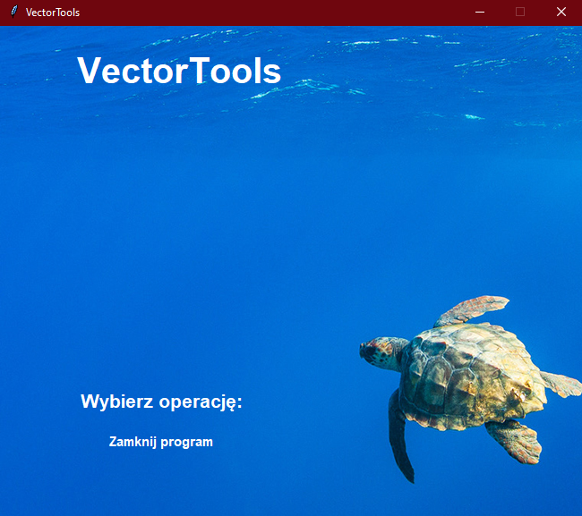
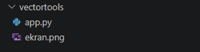
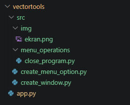

## Wstęp - Stworzenie VectorTools

1. **Przygotowanie pierwszej wersji programu**

Zgodnie z założeniami zajęć, chcemy poznawane przez nas metody obudowywać w działający program. Na początku jednak przygotować musimy szkielet aplikacji.
Poniżej przedstawiam bardzo prosty pomysł na przygotowanie prostego okienka. Aplikację da się uruchomić, a w menu opcji wybrać zamknięcie programu. W przyszłości do menu trafi dużo więcej elementów - chociażby wczytanie pliku - na razie jednak zależy nam na samym szkielecie.

Do realizacji UI wykorzystano bibliotekę tkinter.

Mój przykład:

```python
import tkinter as tk

# Definicje metod:

def close_program():
    window.destroy()


# Utworzenie głównego okna + canvas:

window = tk.Tk()
window.title("VectorTools")
window.resizable(False, False)

canvas = tk.Canvas(
    window,
    width=650,
    height=550,
    highlightthickness=0
)

canvas.pack()


# Grafika tła:

background_screen = tk.PhotoImage(file="ekran.png")

canvas.create_image(
    0,
    0,
    image=background_screen,
    anchor="nw"
)


# Tytuł programu:
canvas.create_text(
    200,
    50,
    text="VectorTools",
    font=("Arial", 30, "bold"),
    fill="white"
)


# Menu:

canvas.create_text(
    180,
    420,
    text="Wybierz operację:",
    font=("Arial", 16, "bold"),
    fill="white"
)


# Przycisk zamknięcia:

canvas.create_text(
    180,
    465,
    text="Zamknij program",
    font=("Arial", 11, "bold"),
    fill="white",
    tags="zamknij"
)

canvas.tag_bind(
    "zamknij",
    "<Button-1>",
    lambda event: close_program()
)

canvas.tag_bind(
    "zamknij",
    "<Enter>",
    lambda event: canvas.itemconfig(
        "zamknij",
        fill="#90E0EF"
    )
)

canvas.tag_bind(
    "zamknij",
    "<Leave>",
    lambda event: canvas.itemconfig(
        "zamknij",
        fill="white"
    )
)

# Główna pętla programu:

window.mainloop()
```

Powyższy kod odpowiada za przygotowanie następującego widoku:



Jak widzicie w tym przykładzie program zyskał twarz sympatycznego żółwia, jednak wy śmiało dostosujcie pomysły na wasze programy zgodnie z własną inwencją i estetyką!

2. **Pierwsza refaktoryzacja**

Naszą aplikację budować będziemy za pomocą ciągłych usprawnień, rozwinięć i refaktoryzacji. Na pierwszą z nich czas jest już teraz.
Obecnie po wrzuceniu skryptu przedstawionego powyżej oraz dodaniu pojedynczego obrazka, nasza struktura wygląda następująco:



Na teraz może wydawać się to niegroźne i wystarczające, ale łatwo przewidzieć że jeśli nie zmienimy obecnej metodologii to tylko kwestia czasu aż nie przygniecie nas bałagan.

Już teraz mimo że nasz program jedynie się otwiera i zamyka, zajmuje to ~90 linijek kodu w pythonie. Realizują jednak one osobne zadania (np tworzenie przycisku, logikę zamykania) które naturalnie mogłyby się znajdować w osobnych plikach .py.

Podobnie nasza grafika - nie powinna leżeć obok skryptu, a w jakimś dobrze poukładanym schemacie plików.

Plik app.py powinien stać się jedynie punktem wejścia wywołującym całą siatkę potrzebnych funkcji w wielu małych, realizujących pojedynczą odpowiedzialność plikach.

Ta intuicyjna filozofia nazywana jest czasem w programowaniu  **Single Responsibility Principle (SRP)**.

Poniżej propozycja podziału na bardziej rozbitą strukturę:



Zawartość każdego z plików:

*app.py*
```python
from src.create_window import create_window
from src.create_menu_option import create_menu_option
from src.menu_operations.close_program import close_program

window, canvas = create_window()

create_menu_option(canvas, 465, "Zamknij program", lambda: close_program(window))

window.mainloop()
```

W przyszłości i tak będziemy chcieli jeszcze bardziej odchudzić ten plik, jednak już teraz jest on znacząco krótszy i zawiera jedynie kolejne polecenia do wykonania - wywołania funkcji, bez ich definicji.

Warto zwrócić uwagę na sposób komunikacji między plikami - funkcje które pobieramy z innych plików są importowane zgodnie ze strukturą plików.

*create_window.py*
```python
import tkinter as tk

def create_window():
    # Utworzenie głównego okna + canvas:

    window = tk.Tk()
    window.title("VectorTools")
    window.resizable(False, False)

    canvas = tk.Canvas(
        window,
        width=650,
        height=550,
        highlightthickness=0
    )

    canvas.pack()


    # Grafika tła:

    window.background_screen = tk.PhotoImage(
        file="src/img/ekran.png"
    )

    canvas.create_image(
        0,
        0,
        image=window.background_screen,
        anchor="nw"
    )


    # Tytuł programu:
    canvas.create_text(
        200,
        50,
        text="VectorTools",
        font=("Arial", 30, "bold"),
        fill="white"
    )


    # Menu:

    canvas.create_text(
        180,
        420,
        text="Wybierz operację:",
        font=("Arial", 16, "bold"),
        fill="white"
    )

    return (window, canvas)
```

Sama implementacja się tu mocno nie zmieniła - jedyne co dodaliśmy to opakowanie w funkcję oraz deklarację zwrotki.

Wykorzystaliśmy też window.background_screen do przechowywania tła.

*create_menu_option.py*
```python
import tkinter as tk
from collections.abc import Callable

def create_menu_option(
    canvas: tk.Canvas,
    height: int,
    text: str,
    operation: Callable
):
    text_id = canvas.create_text(
        180,
        height,
        text=text,
        font=("Arial", 11, "bold"),
        fill="white"
    )

    canvas.tag_bind(
        text_id,
        "<Button-1>",
        lambda event: operation()
    )

    canvas.tag_bind(
        text_id,
        "<Enter>",
        lambda event: canvas.itemconfig(
            text_id,
            fill="#90E0EF"
        )
    )

    canvas.tag_bind(
        text_id,
        "<Leave>",
        lambda event: canvas.itemconfig(
            text_id,
            fill="white"
        )
    )
```

Sama logika się nie zmieniła, ale tym razem poza opakowaniem w funkcję dodaliśmy też większą parametryzację - wysokość przycisku, wyświetlany tekst, metodę którą ma wywołać kliknięcie.

Dzięki temu stworzyliśmy bardziej uniwersalną, elastyczną funkcję - nie nadaje się już tylko do tworzenia przycisku zamykania ekranu, ale dowolnego przycisku w menu.

Dodaliśmy też łączenie elementów po text_id, a nie tagu, aby podtrzymać tę elastyczność.

*close_program.py*
```python
def close_program(window):
    window.after(0, window.destroy)
```
Dodaliśmy oczekiwanie after() jako dodatkowe zabezpieczenie, aby tkinter poprawnie przetworzył kliknięcie przed zamknięciem programu - w kolejnej pętli zdarzeń.

Warto też zwrócić uwagę że plik znajduje się w osobnym podfolderze menu_operations - jasne wskazanie, że w przyszłości każda logika (zazwyczaj o wiele bardziej skomplikowana niż window.destroy()) dostępna pod menu będzie miała swoją implementację właśnie w tym podfolderze.

**3. Dalsze refaktoryzacje**

Część zmian narzucać będzie dalszy przebieg zajęć, skupione one będą jednak głównie na elementach funkcjonalnych, a nie UI. Śmiało więc poświęccie chwilę na przeszukanie możliwości tkintera i dostosowujcie wizualnie wasze programy już na własną rękę!

